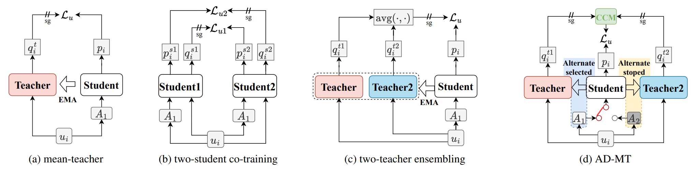

# AD-MT

[Alternate Diverse Teaching for Semi-supervised Medical Image Segmentation](https://arxiv.org/pdf/2311.17325.pdf)



> Semi-supervised medical image segmentation studies have shown promise in training models with limited labeled data. However, current dominant teacher-student based approaches can suffer from the confirmation bias. To address this challenge, we propose AD-MT, an alternate diverse teaching approach in a teacher-student framework. It involves a single student model and two non-trainable teacher models that are momentum-updated **periodically** and **randomly** in an **alternate** fashion.
>
> To mitigate the confirmation bias from the diverse supervision, the core of AD-MT lies in two proposed modules: the Random Periodic Alternate (RPA) Updating Module and the Conflict-Combating Module (CCM). The RPA schedules the alternating diverse updating process with complementary data batches, distinct data augmentation, and random switching periods to encourage diverse reasoning from different teaching perspectives. The CCM employs an entropy-based ensembling strategy to encourage the model to learn from both the consistent and conflicting predictions between the teachers. Experimental results demonstrate the effectiveness and superiority of our AD-MT on the 2D and 3D medical segmentation benchmarks across various semi-supervised settings.

## Usage

Following [SSL4MIS](https://github.com/HiLab-git/SSL4MIS) to prepare the three datasets, and properly setup the path in corresponding config file.

Package: nothing but common ones,

```plaintext
h5py==3.1.0
matplotlib==3.3.4
MedPy==0.4.0
nibabel==3.2.2
numpy==1.19.4
opencv-python==4.4.0.46
pandas==1.1.4
Pillow==8.4.0
PyYAML==5.4.1
scikit-image==0.17.2
scipy==1.5.4
SimpleITK==2.1.1.2
tensorboard==2.4.0
torch==1.10.1
torch-geometric==1.7.0
torchvision==0.8.0a0+45f960c
tqdm==4.54.0=
```


To run, simple check the provided shell files for trianing and testing.

```shell
# setup the config file firstly
cd <ad-mt>
# to train on LA
sh ./train_3d_aut.sh
# to test on LA
sh ./test_3d.sh

```

our training logs are provided for convenient comparisons during reproducing.

## Citation

If you find this project useful, please consider citing:

```bibtex
@article{zhao2023alternate,
  title={Alternate Diverse Teaching for Semi-supervised Medical Image Segmentation},
  author={Zhao, Zhen and Wang, Zicheng and Wang, Longyue and Yuan, Yixuan and Zhou, Luping},
  journal={arXiv preprint arXiv:2311.17325},
  year={2023}
}
```

## Acknowledgement

We thank [UA-MT](https://github.com/yulequan/UA-MT), [SSL4MIS](https://github.com/HiLab-git/SSL4MIS), and [SS-Net](https://github.com/ycwu1997/SS-Net), for part of their codes, processed datasets, and data partitions.

If any questions, feel free to contact me at `zhen.zhao@outlook.com`
